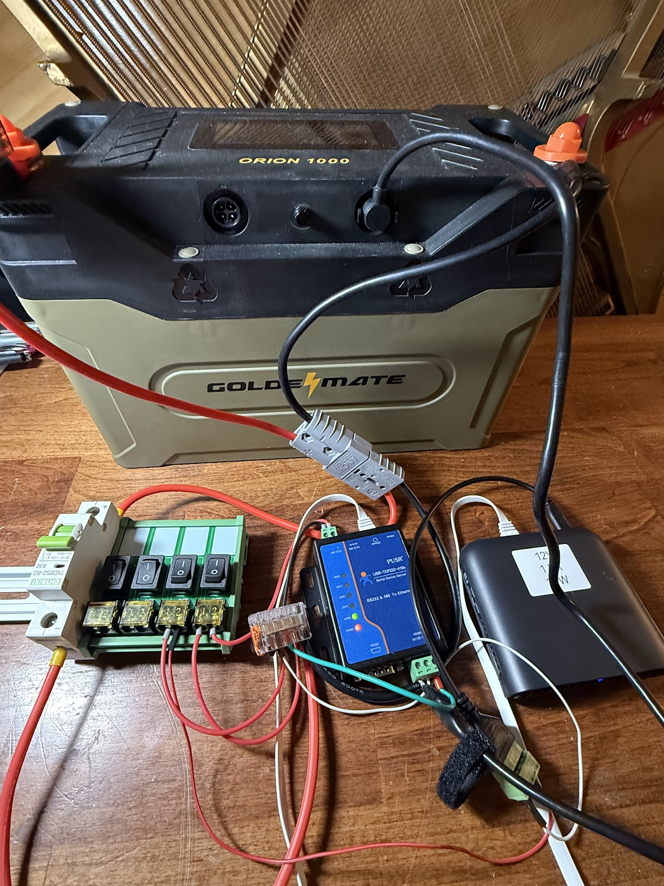

# goldenmate_orion1000_bms

# **WORK IN PROCESS**

High-level Python client for communicating with the Battery Management System (BMS) of the [GoldenMate Orion 1000 LiFePO4 100AH battery](https://goldenmateenergy.com/products/goldenmate-12-8v-100ah-1280wh-lifepo-battery) to retrieve battery information such as voltage and state of charge (SOC) and to configure certain battery parameters (such as whether discharge is enabled).

## Safety, license, and warning

This software is provided “as is” without any warranties, express or implied. Working with lithium and other high-energy batteries involves inherent risks, including fire, injury, and property damage. You are solely responsible for understanding these risks and for the safe use of any hardware or software based on this code. The author makes no guarantees as to accuracy, reliability, or safety, and accepts no liability for any consequences arising from its use. Use at your own risk.

## Attribution

1. As it currently stands, most of the code was generated over the course of a couple of hours with ChatGPT.

2. The [(de)serialization module for the battery's proprietary protocol](./orion1000_bms/protocol.py) was based on ChatGPT providing me with an [English translation](./docs/orion_1000_protocol_english.md) of the [original Chinese documentation PDF provided to me via email by Goldenmate](./docs/orion_1000_protocol_chinese.pdf).

## Hardware

> Note - I'm a novice with IoT and totally new to battery BMS, RS485, Modbus, etc. and figuring this out as I go. There may be better ways to go about this... I'm just sharing what's working for me so far.

### Components

1. An RS485 to Ethernet adapter (I'm using [USR-TCP232-410S](https://www.amazon.com/dp/B0DS24FG9B?ref_=ppx_hzsearch_conn_dt_b_fed_asin_title_4) set to `TCP server` mode and baud rate of `9600 bps`)

2. The BMS cable that came with the Orion 1000 battery (I haven't been able to find an exact match for the four-pin connector they use, though you could hack something together with just one twisted pair of wires for basic testing).

### Physical connection



1. `[Battery BMS Port] -> [RS485 cable's A+B wires] -> [RS485 A+B terminals of RS485 to Ethernet adapter]`
2. `[Ethernet port of RS485 to Ethernet adapter] -> [ethernet port of TP-Link Travel Router]`

> Note - router set to "Repeater mode" and connected to my home WiFi network. When the RS485 adapter is plugged into the ethernet port of the TP Link router, it appears as a wired device as if it was plugged into my main router. I'll eventually replace this router with a similar outdoor-rated mini repeater when the project is done, but the travel router does the job for now and allows me to position the battery anywhere I want. I use the battery to power both the router and the RS485 adapter.

### Current status

Again, this is a work in process... but `main.py` demonstrates using the client in it's current state and I am successfully reading some information from the battery. Not sure if I'm parsing all of the info correctly yet, but some of it definitely looks correct. Here's an example of results:

```sh
mathewwerber@Mathews-MBP goldenmate_orion_1000 % uv run main.py
09:56:50 DEBUG orion1000_bms.client: Initializing Orion 1000 BMS client
09:56:50 INFO orion1000_bms.client: Orion1000BMS initialized for 192.168.99.137:26 (addr=0x01)
09:56:50 INFO orion1000_bms.client: Reading voltage
09:56:50 INFO orion1000_bms.client: Attempt 1/4 sending request to 192.168.99.137:26
09:56:50 DEBUG orion1000_bms.client: Connecting to 192.168.99.137:26
09:56:50 DEBUG orion1000_bms.client: Sending request: EA D1 01 04 FF 02 F9 F5
09:56:56 WARNING orion1000_bms.client: Request attempt 1 failed: read timed out. Retrying...
09:56:56 INFO orion1000_bms.client: Attempt 2/4 sending request to 192.168.99.137:26
09:56:56 DEBUG orion1000_bms.client: Connecting to 192.168.99.137:26
09:56:56 DEBUG orion1000_bms.client: Sending request: EA D1 01 04 FF 02 F9 F5
09:56:56 DEBUG orion1000_bms.client: Raw frame: EA D1 01 0F FF 02 04 06 04 0C EF 0C F1 0C F0 0C F2 E8 F5
09:56:56 DEBUG orion1000_bms.protocol: Checksum debug: span=0F FF 02 04 06 04 0C EF 0C F1 0C F0 0C F2  calc=0xE8  reported=0xE8
{
  "address": 1,
  "series_cells_in_packet": 4,
  "probe_count": 6,
  "system_series_cells": 4,
  "cell_mv": [
    3311,
    3313,
    3312,
    3314
  ]
}
09:56:56 INFO orion1000_bms.client: Reading current status
09:56:56 INFO orion1000_bms.client: Attempt 1/4 sending request to 192.168.99.137:26
09:56:56 DEBUG orion1000_bms.client: Throttling: sleeping 0.082s to enforce inter-request gap
09:56:56 DEBUG orion1000_bms.client: Connecting to 192.168.99.137:26
09:56:56 DEBUG orion1000_bms.client: Sending request: EA D1 01 04 FF 03 F8 F5
09:56:56 DEBUG orion1000_bms.client: Raw frame: EA D1 01 1C FF 03 F0 00 00 00 00 00 00 06 3B 3B 3A 3A 3B 3A 00 00 00 00 00 17 06 00 00 00 06 F5
09:56:56 DEBUG orion1000_bms.protocol: Checksum debug: span=1C FF 03 F0 00 00 00 00 00 00 06 3B 3B 3A 3A 3B 3A 00 00 00 00 00 17 06 00 00 00  calc=0x06  reported=0x06
09:56:56 DEBUG orion1000_bms.protocol: Implicit probe-count layout used: n_probes=6 (derived)
{
  "address": 1,
  "status": 240,
  "discharge_active": false,
  "charge_active": false,
  "mos_temp_present": true,
  "ambient_temp_present": true,
  "current_ma": 0,
  "over_voltage": 0,
  "under_voltage": 0,
  "temp_protect": 0,
  "protect": 6,
  "probe_count": 6,
  "cell_temps_c": [
    19,
    19,
    18,
    18
  ],
  "mos_temp_c": 19,
  "ambient_temp_c": 18,
  "sw_version": 23,
  "mos_state": 6,
  "faults": 0
}
09:56:56 INFO orion1000_bms.client: Reading capacity/SOC
09:56:56 INFO orion1000_bms.client: Attempt 1/4 sending request to 192.168.99.137:26
09:56:56 DEBUG orion1000_bms.client: Throttling: sleeping 0.073s to enforce inter-request gap
09:56:56 DEBUG orion1000_bms.client: Connecting to 192.168.99.137:26
09:56:56 DEBUG orion1000_bms.client: Sending request: EA D1 01 04 FF 04 FF F5
09:56:56 DEBUG orion1000_bms.client: Raw frame: EA D1 01 35 FF 04 01 60 02 00 00 03 00 01 04 86 A0 05 00 01 06 86 A0 07 00 01 08 76 EC 09 FF FF 0A FF FF 0B 00 00 00 00 00 00 00 00 00 00 00 05 2C 0C F2 0C EF 0D 0B 07 F5
09:56:56 DEBUG orion1000_bms.protocol: Checksum debug: span=35 FF 04 01 60 02 00 00 03 00 01 04 86 A0 05 00 01 06 86 A0 07 00 01 08 76 EC 09 FF FF 0A FF FF 0B 00 00 00 00 00 00 00 00 00 00 00 05 2C 0C F2 0C EF 0D 0B  calc=0x07  reported=0x07
{
  "address": 1,
  "soc_percent": 96,
  "cycles": 0,
  "design_capacity_mah": 100000,
  "full_capacity_mah": 100000,
  "remaining_capacity_mah": 95980,
  "remaining_discharge_min": 65535,
  "remaining_charge_min": 65535,
  "current_charge_interval_h": 0,
  "longest_charge_interval_h": 0,
  "pack_voltage_mv": 13240,
  "highest_cell_mv": 3314,
  "lowest_cell_mv": 3311,
  "hw_version": 11,
  "scheme_high_nibble": 0,
  "scheme_low_nibble": 7
}
09:56:56 INFO orion1000_bms.client: Reading battery ID
09:56:56 INFO orion1000_bms.client: Attempt 1/4 sending request to 192.168.99.137:26
09:56:56 DEBUG orion1000_bms.client: Throttling: sleeping 0.048s to enforce inter-request gap
09:56:56 DEBUG orion1000_bms.client: Connecting to 192.168.99.137:26
09:56:56 DEBUG orion1000_bms.client: Sending request: EA D1 01 04 FF 11 EA F5
09:56:56 DEBUG orion1000_bms.client: Raw frame: EA D1 01 05 FF 11 00 EB F5
09:56:56 DEBUG orion1000_bms.protocol: Checksum debug: span=05 FF 11 00  calc=0xEB  reported=0xEB
{
  "address": 1,
  "id_ascii": ""
}
```

## FAQ

### Can I use this with other Goldenmate batteries?

I do not know whether Goldenmate uses the same protocol with their other battery models, nor do I know if and when they update the protocol for newer versions of the Orion 1000 battery. For the most up-to-date protocol information for your battery, you may want to contact Goldenmate directly and ask for up-to-date documentation.

### My use case?

Personally, I plan to use my battery to power a few IoT devices (e.g. automatic door, light, camera) in a chicken coop that is not connected to the grid. The battery will be charged by a solar array and I want to use HomeAssistant (HA) to monitor battery status, health, charge etc. Once this Python client is done, I can wrap it into a custom HA integration. You could use or adapt this client for your own battery monitoring/automation goals, with or without HomeAssistant.

### Why this project exists?

1. Goldenmate states on their website and the documentation that came with the battery that the battery supports "Bluetooth, CAN bus, and RS485/Modbus". However, bluetooth is only via their mobile app and they don't actually support standard modbus... they use a proprietary serial protocol over a physical RS485 (or CAN bus) connection.

2. Goldenmate does not publish the details of their proprietary serial protocol, though I requested this over email and they were kind enough to share the details via PDF (see docs/).
